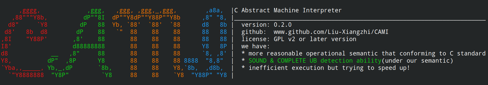
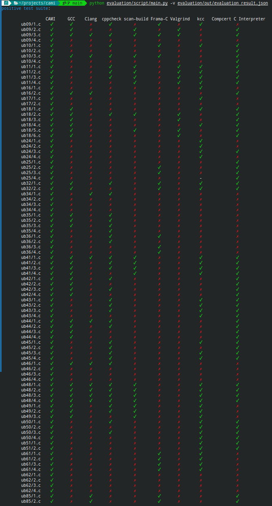
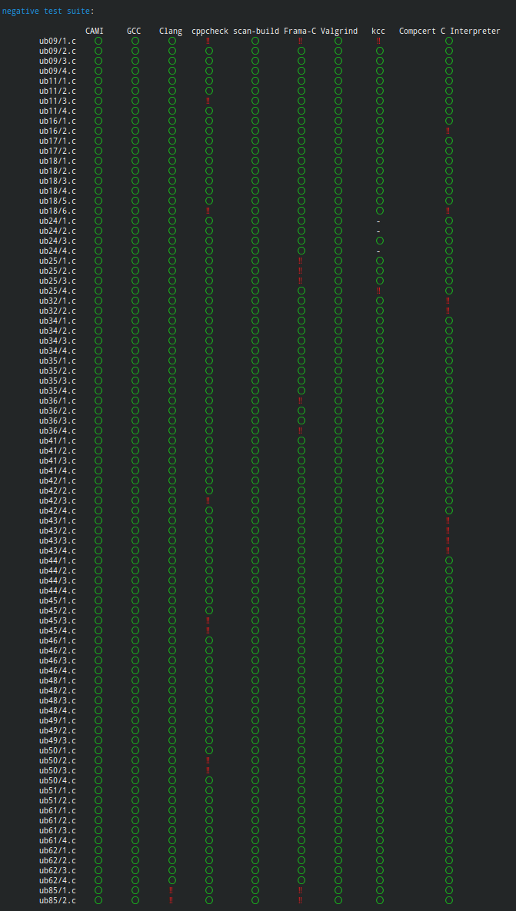
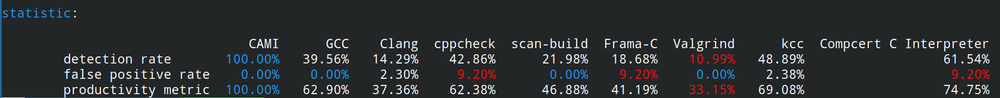

# <center>CAMI</center>

C Abstract Machine Interpreter, also an examiner of your C programs.

See [here](./doc/index.md) for other languages.

## Introduction
CAMI is an interpreter and detector based on a formal operational semantic that conforming to [C23 standard(working draft N3096)](https://www.open-std.org/JTC1/SC22/WG14/www/docs/n3096.pdf). It aims to detect potential **undefined behavior** in C program and also has the ability to detect some other common defects(but not undefined behavior), such as memory leak.

CAMI executes bytecode files(referring to the [CAMI bytecode specification](./doc/en_us/cami_bytecode.md)) in text or binary form (not yet supported) as blueprints. If the bytecode file passed is not linked, CAMI will automatically, recursively, find bytecode files depended on by that file and link them together.

For more details, see [operational semantic of C](./doc/en_us/operational_semantic.md) or [interal implementation](./doc/en_us/internals.md).

### Why CAMI?
Frankly speaking, CAMI hasn't made significant theoretical advancements, but our aim is towards greater practical usability (which is also why we opted for operational semantics).

Compare to other similar software:
+ CAMI's execution process aligns more closely with the description in the C language standard, allowing for a more intuitive observation of the program's flow
+ CAMI separates the C language source code and bytecode, which makes it possible to exetend to other langauges(e.g. C++)
+ CAMI allows for easy addition of debug functionality, providing a high level of control over the program that other software lacks
+ CAMI is more customizable, users can customize it without too much learning of its underlying formal semantic.

In terms of expressive ability, CAMI's operational semantics are more aligned with practical application scenarios, striving to treat certain implementation-defined behaviors and unspecified behaviors specified in C standard as legal operations and in line with intuitive understanding as much as possible. For instance, for the following code,
``` c
// a.c
// this program contains implementation-defined behavior, but doesn't contain undefined behavior
#include <stdio.h>
#include <stdint.h>

int main()
{
    int x[2] = {1, 2};
    uintptr_t i = (uintptr_t)x;
    int* p = (int*)(i + sizeof(int));
    printf("%d\n", *p);
}
```
the running result of different software are as follows
``` shell
> gcc a.c && ./a.out
2
> cami run a.tbc
2
[info]Abstract machine halt with return code 0
> ccomp -interp a.c
Stuck state: in function main, expression <loc p> = (int *) (<ptr x> + 4LLU)
Stuck subexpression: <ptr x> + 4LLU
ERROR: Undefined behavior
```
In terms of expressive detection, CAMI has **SOUND and COMPLETE** detection ability(under our semantic), which is far ahead of similar software(see[Detection Ability Evaluation](#detection-ability-evaluation)). Even for some tricky program that conatians undefined behavior, such as [ub09/4.c](./evaluation/test_suite/positive/ub09/4.c), CAMI can singled out the "villain" at a glance. In contrast, the other detection tools we selected were powerless against it.

However, you can't have your cake and eat it too. CAMI naturally has its flaws, with the most significant issue being its execution efficiency. For compute-intensive programs, CAMI's execution efficiency is approximately 1 to 1.5 orders of magnitude lower than that of equivalent logic CPython programs. To address this deficiency, we plan to adopt JIT technology or hardware acceleration techniques. Additionally, we currently lack a compiler from C language source code to CAMI bytecode, which is also a problem we need to address in our next steps.

### Operational Semantic
We define the operational semantic of C language by the following steps:
+ formally define the state and transition of abstract machine
+ formally define the tranlation rules from C souce code AST to initial state(i.e. CAMI bytecode) of abstract machine
  
Refer to [operational semantic of C](./doc/en_us/operational_semantic.md) for details, or [CAMI bytecode specification](./doc/en_us/cami_bytecode.md) for natural language description of instructions of absctract machine.

Please note that the complete mathematical formulation of operational semantics is still being integrated and organized.

### Feature Support
Considering to the workload, we do not support those features now (standard libary of C is also not supported):
+ `Complex`, `_BitInt` and `Decimal float` types and other extend floating types
+ `restrict` and `atomic` qualifier
+ bit-field
+ multi-threading
+ signal
+ VLA
+ flexible array member
+ attribute

Due to certain inconsistencies in the C standard regarding the effective type of allocated storage duration objects and other semantic rules (such as pointer arithmetic), we modified the behavior of `malloc` to resemble the behavior of the `new` operator in C++/Java.

For more infomation of feature supporting, implementation-defined behavior and locale-specific behavior, see [feature support document](./doc/en_us/feature_support.md).

### Detection Target
Our detection target is undefined behaviors that cannot be completely detected at compile time. Meanwhile, due to some unsupported feature, we eliminated UB 5(data race), 38(access subobject of atomic object), 65(restrict related), 66(restrict related), 72(VLA related), 83(attribute related). The remaining undefined behaviors are as follows:

+ 9 An object is referred to outside of its lifetime
+ 10 The value of a pointer to an object whose lifetime has ended is used
+ 11 The value of an object with automatic storage duration is used while the object has an indeterminate representation
+ 12 A non-value representation is read by an lvalue expression that does not have character type
+ 13 A non-value representation is produced by a side effect that modifies any part of the object using an lvalue expression that does not have character type
+ 16 Conversion to or from an integer type produces a value outside the range that can be represented
+ 17 Demotion of one real floating type to another produces a value outside the range that can be represented
+ 18 An lvalue does not designate an object when evaluated
+ 20 `@11` An lvalue designating an object of automatic storage duration that could have been declared with the register storage class is used in a context that requires the value of the designated object, but the object is uninitialized
+ 23 Conversion of a pointer to an integer type produces a value outside the range that can be represented
+ 24 Conversion between two pointer types produces a result that is incorrectly aligned
+ 25 A pointer is used to call a function whose type is not compatible with the referenced type
+ 32 The program attempts to modify a string literal
+ 34 A side effect on a scalar object is unsequenced relative to either a different side effect on the same scalar object or a value computation using the value of the same scalar object
+ 35 An exceptional condition occurs during the evaluation of an expression
+ 36 An object has its stored value accessed other than by an lvalue of an allowable type
+ 37 `@25` A function is defined with a type that is not compatible with the type (of the expression) pointed to by the expression that denotes the called function
+ 39 `@18` The operand of the unary \* operator has an invalid value
+ 41 `@35` The value of the second operand of the / or % operator is zero
+ 42 If the quotient a/b is not representable, the behavior of both a/b and a%b
+ 43 Addition or subtraction of a pointer into, or just beyond, an array object and an integer type produces a result that does not point into, or just beyond, the same array object
+ 44 `@18` Addition or subtraction of a pointer into, or just beyond, an array object and an integer type produces a result that points just beyond the array object and is used as the operand of a unary \* operator that is evaluated
+ 45 Pointers that do not point into, or just beyond, the same array object are subtracted
+ 46 An array subscript is out of range, even if an object is apparently accessible with the given subscript
+ 47 The result of subtracting two pointers is not representable in an object of type ptrdiff_t
+ 48 An expression is shifted by a negative number or by an amount greater than or equal to the width of the promoted expression
+ 49 An expression having signed promoted type is left-shifted and either the value of the expression is negative or the result of shifting would not be representable in the promoted type
+ 50 Pointers that do not point to the same aggregate or union (nor just beyond the same array object) are compared using relational operators
+ 51 An object is assigned to an inexactly overlapping object or to an exactly overlapping object with incompatible type
+ 61 An attempt is made to modify an object defined with a const-qualified type through use of an lvalue with non-const-qualified type
+ 62 An attempt is made to refer to an object defined with a volatile-qualified type through use of an lvalue with non-volatile-qualified type
+ 86 The } that terminates a function is reached, and the value of the function call is used by the caller

where the meaning of `M @N` is that undefined behavior M is the subset of undefined behavior N.

### Detection Ability Evaluation
To compare the detection ability among different detection softwares, we constructed 178 test cases and divided them into two suite: positive and negative. The former is to evaluate detection rate, while the latter is to evaluate false positive rate. Evaluation results are as following:




where, the productivity metric is the geometric average of detection rate and 100% minus false-positive and the best and worst values in statistic for each indicator are highlighted in blue and red, respectively.

## Build
Note:
+ let `${PROJECT_ROOT}` denote the root directory of this project, therebehind and other document.

### For Arch/Manjaro Linux
Run the following command to install.
```shell
sudo yay -S cami
```
Note that yay will compile and install cami using default configure. If you want to customize the configuration, you need to install by yourself following the instructions in the following text.

### Configure (optional)
Modify the configuration items in `${RROJECT_ROOT}/config/config.toml` to configure different parameters.
See [here](./doc/en_us/config_manual.md) for detail.
### supporting test (optional)
There's some implementation-defined behavior in source code of CAMI. Although those behaviors behaves same in most platform, there may be some "distinctive" platform. Therefore, you can run the following command to see if the current platform supports it. You will see `OK` in terminal if supported, otherwise, the reason why not supported.
```shell
cmake -S . -B build
cmake --build build --target supporting_test
./build/src/supporting_test
```

### Compile
```shell
cd ${PROJECT_ROOT}
cmake -S . -B build # option
cmake --build build
```
Some other parameters can be set at the position of `option`, such as `CAMKE_BUILD_TYPE`, `CAMKE_INSTALL_PREFIX`, etc. Refer to [CMake](https://cmake.org/cmake/help/latest/manual/cmake.1.html).

### Install (optional)
```shell
cd ${PROJECT_ROOT}
cmake --build build --target install # may need 'sudo'
```

## Usage
```shell
cami run <bytecode_file_path>
```

### Running Example
run the following command:
``` shell
cami run ${PROJECT_ROOT}/etc/example_hello_world.tbc
```
will get output:
```
hello world!
[info]Abstract machine halt with return code 0
```

## Project File Structure
```
.
├── CMakeLists.txt
├── compiler                       # Compiler that translates C source code into CAMI bytecode(not implemented)
├── config                         # CAMI configuration directory
│   ├── config.toml               # configuration file
│   └── configure.py              # script that translate configure into macro defines
├── doc                            # documents
│   ├── asset                     # binary files(mostly images) used in documents
│   ├── cami.1                    # Man page for CAMI
│   ├── en_us                     # English edition
│   ├── index.md                  # index file, nagigate to ReadMe files in different languages
│   └── zh_cn                     # Chinese(simplified) edition
├── etc                            # etc
│   ├── ascii_logo.txt            # logo of this project
│   ├── cami_bc_cloc_conf.txt     # cloc configure file, in order to make cloc recognize CAMI bytecode
│   ├── ccl.sh                    # script that counts the number of code lines of this project
│   └── example_hello_world.tbc   # an example of CAMI bytecode file, prints "hello world"
├── evaluation                    # evaluation directory
│   ├── bin
│   │   └── cami.sh              # wrapper of CAMI, translate the path of C source code into pre-compiled bytecode and forward it to CAMI
│   ├── config
│   │   └── config.json          # configuration files of detection softwares
│   ├── Dockerfile                # Docker script for building the environment of evaluation
│   ├── out
│   │   └── CAMI                 # pre-compiled CAMI bytecode files
│   ├── requirements.txt          # list of python packages that our scripts depend on
│   ├── script                    # automatic evaluation scripts
│   └── test_suite                # test cases
├── include                        # CAMI header files
├── LICENSE                        # GPLv2 license
├── ReadMe.md                      # this file
└── src                            # CAMI source code
```

## Possible Improvement
+ complete the development of compiler
+ support multi-threading and multi-process
+ support binary form bytecode file
+ provide more detail output info
+ support more format types(e.g. json, yaml) for AM
+ support serialization & deserialization of AM
+ provide more precise debug info & support more debug manipulations(e.g. step execution, breakpoint)
+ fulfil the atomicity of execution(an instruction either executes successfully or fails without changing any state of AM)

**Note**: restrict to the time of development(as this project is my bachelor thesis project), 
please do not impose too much requirement or expectation on the code quality of this program(**DONE IS BETTER THAN PERFECT**), and this program is **NOT** undergone exhausted test.

