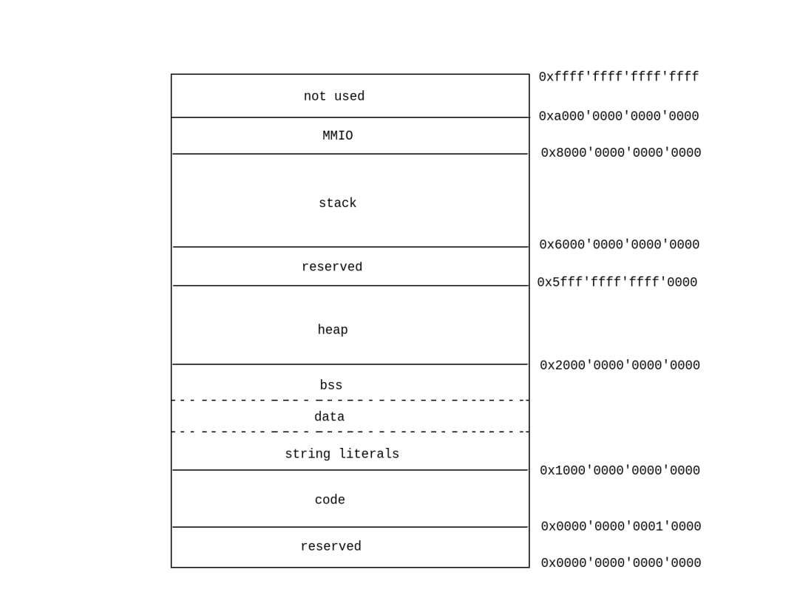

# CAMI Internal Implementation
The internal implementation document contains a lot of design content and is being gradually expanding and improving.

## Abstract Machine
### Overview
Considering that C language is based on expression evaluation, which is suitable to use a stack, we design the abstract machine as a stack machine, with the following structure:


where:
+ The object designation register serves as the hub for accessing objects. All accesses to objects require designating the object first, and the result of designating the object will be stored in the object designation register
+ The operand stack is used for expression evaluation and is the core of the computation functionality. Additionally, functionality such as function calls and pointer dereferencing also involves the operand stack
+ The memory is used to store data actually read and written by the CAMI process. Memory adopts a segmented mechanism, detailed in [Memory Management](#memory-management)
+ The static information records information obtained from the C language source code, such as function names, function types, and the sequence after relationship of various trace events within a full expression in the source file
+ The dynamic information (state) maintains the running state of the abstract machine, mainly for maintaining normal data flow transitions and detecting undefined behavior. The entity map records the mapping from entity addresses to entities under the current state, used for type conversions from integer to pointer

> A CAMI process refers to an instance of bytecode running on CAMI, rather than a process named cami running on the host machine. This can be analogue to the relationship between a process running inside a virtual machine and the virtual machine itself.
> 
> An entity is defined as an object or a function.
> 
> A trace event refers to the collective term for function calls, object modifications, non-lvalue conversions reading objects, and object deletions.

The operation logic of the abstract machine is similar to that of a CPU, which involves fetching, decoding, executing, and looping. Specifically:

+ The abstract machine fetches and decodes instructions from memory based on the PC value.
+ If the current instruction is a halt instruction, the machine halts.
+ Otherwise, it performs undefined behavior detection and executes the current instruction.
+  + If the current instruction is a control flow control instruction, it changes the program pointer and/or call stack information, then jumps to the first step for execution.
+  + If the current instruction is an object designating instruction, it designates the object based on the top element of the operand stack or current instruction information, and saves the object metadata to the object designation register.
+  + If the current instruction is an object read/write instruction, it reads from or writes to the value of the object designated by the object designation register, involving read and write operations on the operand stack and data area.
+  + If the current instruction is an object create/delete instruction, it creates, modifies, or deletes object metadata information.
+  + If the current instruction is a computation instruction, it pops the top (and sub-top) element(s) from the stack for computation and pushes the result back onto the stack.
+  + If the current instruction is a stack operation instruction, it performs stack push, pop, duplication, etc.
+ Update the PC value and jump to the first step for execution.

A schematic diagram illustrating the operation logic is as follows:


### Expression Evaluation
The process of expression evaluation in CAMI fully adheres to the description in the C23 standard. To reduce complexity, we have divided this process into three layers: the abstract machine layer, the ValueBox layer, and the raw value layer.

#### Raw Value Level
The raw value layer handles operations among real numbers of the same type and equality comparisons between pointer types and nullptr_t types. The latter is relatively simple and will not be elaborated further. For the former, it primarily performs value calculations and detects undefined behavior, such as overflow or negative left operand of shift operators. Integer values are stored using objects of type `uint64_t` and undergo automatic extension (zero extension and sign extension). Floating-point values are stored using the `float` and `double` types in C and undergo hardware-based operations directly (i.e., arithmetic operations on floating-point data are performed directly using the operators at the C language level, rather than being simulated in software).

#### ValueBox Level
The ValueBox is a wrapper for values of all types and holds ownership of the wrapped value. Its existence facilitates the creation and deletion of values, as well as operations among real type numbers. The ValueBox does not participate in pointer operations. It performs integer promotion and usual arithmetic conversion, forwarding the converted result to raw value layer for further processing.

#### Abstract Machine Level
Abstract machine level separates pointer operations from real number operations, with the latter delegated to the ValueBox level. Pointer operations are divided into three types: addition (subtraction) of pointer and integer, subtraction between pointers, and comparison between pointers. For detailed behaviors, please refer to the [Operational Semantic of C](./operational_semantic.md) documentation.

### Static Information
Static information includes descriptions of functions and static or thread storage duration objects, as well as all constants and types used in the program.

Descriptions of objects with static or thread storage duration include the object's name, type, and address.

Descriptions of functions include the function's name, type, address, the source file where the current function's implementation resides, stack frame size, function bytecode size, maximum number of simultaneously live automatic storage duration objects, block descriptions, full expression information, and location information (mapping from function bytecode address to C program source code line number).

> The function bytecode is defined as the abstract machine instructions within CAMI bytecode that describe the function's execution logic. Function bytecode is a part of CAMI bytecode, specifically the `code` field of function objects within the CAMI bytecode function section.
>
> For details regarding block description, full expression information, and location information, please refer to the [CAMI bytecode specification](./cami_bytecode.md).

### Dynamic Information
Dynamic information includes the Program Counter(PC), Frame Pointer(FP), Entity Map, and Call Stack Information.

The Call Stack Information contains the current function instances(distinguished from static function information). Each function instance records its corresponding static information, return address, entered blocks, object metadata of currently alive automatic storage duration objects, and execution path tracing information.

Recording entered blocks(since the `lb` instruction does not include the ID of the block to leave) is used for creating and deleting automatic storage duration objects.

Object metadata records the status information of associated objects, including the object's name, type, address, status (well-formed, destroyed, uninitialized, or non-value representation), trace event tags(see next section), and references between object metadata(sub-objects, reference object, referenced objects).

Execution path tracing information is used to trace the execution history of functions, primarily for detecting UB 34. It includes the ID of the current full expression being evaluated, how many full expressions the current function has completed (i.e., the meaning of `full_expr_exec_id`), and the trace context of the current function instance.

#### Trace Context


A trace context(represented by rectangles in the diagram) is uniquely associated with a function instance (and vice versa). It records the trace context of the parent function of its associated function instance and the call point of the associated function instance within its parent function (the location where the function call that generated this function instance occurred, represented by blue or purple circles in the diagram).

Trace event tags (represented by circles in the diagram) record the trace context of a trace event and its location within the tracing context. Location information can be represented using the Full Expression Execution ID (`full_expr_exec_id`) and inner ID.

The purpose of trace contexts is to trace the call history of functions. By using trace event tags, you can find their trace context and location within it. Through this trace context, you can find the parent trace context, and so on, to obtain the complete call history of the trace event.

> A new function instance is created each time a function call occurs.
>
> The parent function of a function instance is defined as a function instance that called this function instance.
>
> The type of a trace event tag is the type of trace event the tag records.

### Object Designation Register
The object designation register stores the object metadata of the currently designated object, along with the type of lvalue desginating that object and offset. The existence of the latter two is necessary. For example:

```c
int x = 0;
char* p = (char*)&x;
int y = *(p + 1);
```

In the above code, `*(p + 1)` designates the object `x`, but the lvalue type is `char`, not `int`, and there is a one-byte offset relative to the base address of `x`.

### Operand Stack
The operand stack temporarily stores the operation result, and its elements are rich values, which is a combination of ValueBox and attributes. Currently, rich values have two attributes:

1. Whether the value is indeterminate representation.
2. Whether the value is obtained by directly read from an object rather than as a result of an operation.

> The naming of rich values is inspired by "rich text".

### Memory Management

The memory segmentation is illustrated in the above diagram, where the actual lengths of the code and data segments are determined during CAMI startup. The heap segment utilizes a paging management mechanism (refer to virtual memory management in modern operating systems), where users can configure the page size (default size is 16K) and the level of the page table (default is four-level page table). The MMIO segment currently consists of eight objects, named `control` and `word0` through `word6`. The `control` object is used to specify the operation being performed, while the `wordN` objects specify parameters. For usage examples, refer to the `puts` function in [hello_world.tbc](../../etc/example_hello_world.tbc). Avaliable value to write to `control` object and its paramters are as following:

|operation|control|word0|word1|word2|word3|word4|word5|word6|
|---------|-------|-----|-----|-----|-----|-----|-----|-----|
| open file|0|address of file name|length of file name|open mode|assigned file descriptor or -1 for CAMI to allocate|-|-|-|
|close file|1|file descriptor to close|-|-|-|-|-|-|
|read file|2|file descriptor to read|address of result buffer|length to read|-|-|-|-|
|write file|3|file descriptor to write|address of data to write|length to write|-|-|-|-|
|seek|4|File descriptor to move|Target (file head, tail, or current position)|Offset|-|-|-|-|
|truncate|5|file descriptor to truncate|new size|-|-|-|-|-|
|rename file|6|address of original file name|length of original file name|address of new file name|length of new file name|-|-|-|
|delete file|7|address of file to delete|length of file name|-|-|-|-|-|
|duplicate file descriptor|8|source file descriptor|target file descriptor|-|-|-|-|-|

The `control` object will set an error code upon completion of the operation (reading and writing file operations may also return the actual length read or written in byte) to indicate whether the operation was successful. If the error stems from a failure in a system call, `word0` object will additionally indicate the error code of that system call.

Currently, the aforementioned operations and parameters are all encapsulations of the corresponding POSIX file operation APIs.

### Object Metadat Management
We've implemented garbage collection to manage the lifetime of object metadata. In terms of garbage collection algorithms, we employ a generational garbage collection approach, dividing object metadata into young generation and old generation. The young generation region further consists of an eden space and two survivor spaces. When the eden region is full, a minor GC (garbage collection) is triggered, and when the old generation region is full, a major GC is triggered. If after garbage collection there's still insufficient space, it results in a out of memory, and CAMI immediately halts.


## Translator
In addition to text and binary forms of bytecode, we also defined a memory form bytecode file, which is divided into pre-linking (unlinked) memory form bytecode and linked memory form bytecode. The former is more suitable for linking operations, while the latter better suits the requirements of the abstract machine.

### Assembler
The CAMI assembler first performs recursive descent syntax parsing, executes simple static checks, and generates unlinked memory form bytecode. If the current bytecode file type is an executable or dynamic link file, the assembler automatically invokes the linker to link the file.

### Disassembler
The disassembler receives memory form bytecode and outputs text form bytecode. The bytecode obtained after disassembly can be assembled again without loss of information.

### Linker
CAMI supports linking one or more object files into one object file, executable file, or dynamic link file.

#### Linking to Object File
Linking multiple object files into one object file involves the following operations:
+ linking the attributes of each object file
+ + determining the module name or entry function of the linked file
+ + merging and deduplicating the filenames of all object files that need static linking, then removing all filenames involved in the current linking process
+ + merging and deduplicating the filenames of all object files that need dynamic linking
+ discarding all comment sections of object files
+ simply merging the object and function sections of all object files together
+ deduplicating and relocating string literals
+ merging and deduplicating all existing types and constants

#### Linking to Dynamic Link File
linking multiple object files into one dynamic link file involves the following operations:
+ linking multiple object files into one object file
+ reordering the function and object sections of the resulting object file so that functions or objects of the same segment are grouped together without changing their relative positions(we this process as 'arrange')
+ relocating symbol information in the function bytecode, converting symbols to numbers
+ correcting the addresses of functions and objects

#### Linking to Executable File
The linker first links the input into an object file, inserts a startup function, and performs the same operations as "linking to a dynamic link file" (reordering, relocating, and correcting addresses). The first instruction of the startup function is the first instruction executed after CAMI starts. The startup function sequentially calls all initialization functions, thread initialization functions, and entry functions and then halts.
