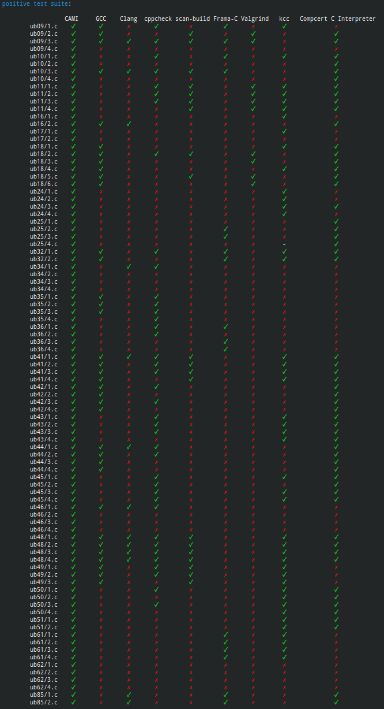
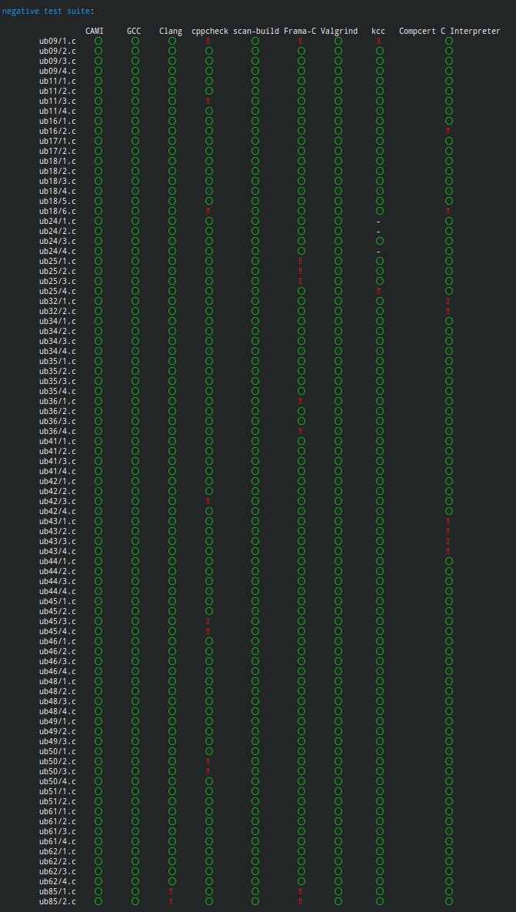
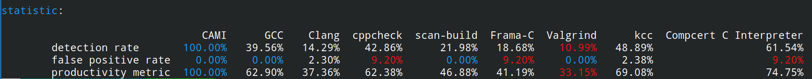

# <center>CAMI</center>

C 语言抽象机解释器，亦即 C 程序检测器。

点击[这里](../index.md)查看其他语言。

## 介绍
CAMI 是一款基于符合 [C23标准（working draft N3096）](https://www.open-std.org/JTC1/SC22/WG14/www/docs/n3096.pdf)的形式化操作语义的解释器、检测器，其主要目的在于对 C 语言程序中可能存在的**未定义行为**进行检测但同时也具备对如内存泄漏等其他非未定义行为但常见的问题的检测能力。

CAMI 接收文本或二进制形式（暂未支持）的字节码文件（参见[CAMI字节码规范](./cami_bytecode.md)）作为蓝本进行执行。若传入的字节码文件未经链接，CAMI会自动（递归地）寻找该文件依赖的其他字节码文件并链接。

关于更多细节，参见[操作语义](#操作语义)或[内部实现](./internals.md)。

### Why CAMI？
坦率地讲，CAMI 并没有在理论上取得很大的进展，但我们的目标在于更高的实际可用性（这也是我们选择操作语义的原因）。

与其他同类型的软件相比
+ CAMI 的执行流程更符合 C 语言标准的描述，可以直观地观察到程序的流程
+ CAMI 分离了 C 语言源代码和字节码，为扩展到其他源语言（如 C++）提供了可能
+ CAMI 可以方便地添加 debug 功能，拥有其他软件所不具备的对程序的高度控制权
+ CAMI 更加可定制，用户不必过多了解软件所基于的形式语义即可进行定制化操作

在表达能力上，CAMI 基于的操作语义更加贴合实际的应用场景，尽可能地将一些标准文档中规定的实现定义行为和未指定行为视为合法操作且符合朴素的理解，例如，对于如下代码
``` c
// a.c
// this program contains implementation-defined behavior, but doesn't contain undefined behavior
#include <stdio.h>
#include <stdint.h>

int main()
{
    int x[2] = {1, 2};
    uintptr_t i = (uintptr_t)x;
    int* p = (int*)(i + sizeof(int));
    printf("%d\n", *p);
}
```
不同软件的运行结果如下
``` shell
> gcc a.c && ./a.out
2
> cami run a.tbc
2
[info]Abstract machine halt with return code 0
> ccomp -interp a.c
Stuck state: in function main, expression <loc p> = (int *) (<ptr x> + 4LLU)
Stuck subexpression: <ptr x> + 4LLU
ERROR: Undefined behavior
```

在检测能力上，CAMI 具有**合理且完备**的检测能力（在我们定义的操作语义下），“遥遥领先于同行”（参见[检测能力评估](#检测能力评估)）。即便针对一些”刁钻的“含有未定义行为的程序，如[ub09/4.c](../../evaluation/test_suite/positive/ub09/4.c)，CAMI 的火眼金睛依然没有放过任何一个坏人。相比之下，我们选取的其他检测工具则对其束手无策。

然而，鱼和熊掌不可兼得，CAMI 自然也存在其缺陷，最主要的问题在于其执行效率。针对计算密集型程序，CAMI 的执行效率比同等逻辑的 CPython 程序低大约1至1.5个数量级。为解决该缺陷，我们预计采用 JIT 技术或硬件加速技术。此外，我们目前还缺少从 C 语言源程序到 CAMI 字节码的编译器，这也是我们下一步需要解决的问题。


### 操作语义
我们通过如下形式给出 C 语言的操作语义：
+ 形式化定义抽象机的状态及状态转移
+ 形式化定义 C 程序语法树到抽象机初始状态的转换关系

参见[C 语言操作语义](./operational_semantic.md)获取详细信息，或参见[CAMI字节码规范](./cami_bytecode.md)查看抽象机指令的自然语言简述。

注意，完整的操作语义数学表述还在整合、组织中。

### 特性支持

出于对工作量的考虑，我们暂不支持如下特性（且并未提供标准库的支持）：
+ `Complex`，`_BitInt` 和 `Decimal float` 类型以及其他扩展浮点数类型
+ `restrict` 和 `atomic` 类型限定符
+ 位域
+ 多线程
+ 信号
+ VLA
+ flexible array member

同时，由于 C 标准对于 allocated 存储周期对象的 effective type 的规定和其他语义规定（如指针加法）存在一定的不自洽性，我们对 malloc 的行为进行了修改，修改后的行为和 C++/Java 的 new 运算符类似。

更多关于特性支持、实现定义行为、本地化行为的信息参见[特性支持文档](./feature_support.md)。

### 检测目标
我们的检测目标是所有在编译期不可确定的未定义行为。同时，由于部分特性未支持，我们剔除了未定义行为 5（数据竞争）、38（访问原子对象）、65（restrict相关）、66（restrict相关）、72（VLA相关），剩余未定义行为如下：

+ 9 An object is referred to outside of its lifetime
+ 10 The value of a pointer to an object whose lifetime has ended is used
+ 11 The value of an object with automatic storage duration is used while the object has an indeterminate representation
+ 12 A non-value representation is read by an lvalue expression that does not have character type
+ 13 A non-value representation is produced by a side effect that modifies any part of the object using an lvalue expression that does not have character type
+ 16 Conversion to or from an integer type produces a value outside the range that can be represented
+ 17 Demotion of one real floating type to another produces a value outside the range that can be represented
+ 18 An lvalue does not designate an object when evaluated
+ 20 `@11` An lvalue designating an object of automatic storage duration that could have been declared with the register storage class is used in a context that requires the value of the designated object, but the object is uninitialized
+ 24 Conversion between two pointer types produces a result that is incorrectly aligned
+ 25 A pointer is used to call a function whose type is not compatible with the referenced type
+ 32 The program attempts to modify a string literal
+ 34 A side effect on a scalar object is unsequenced relative to either a different side effect on the same scalar object or a value computation using the value of the same scalar object
+ 35 An exceptional condition occurs during the evaluation of an expression
+ 36 An object has its stored value accessed other than by an lvalue of an allowable type
+ 39 `@18` The operand of the unary \* operator has an invalid value
+ 41 `@35` The value of the second operand of the / or % operator is zero
+ 42 If the quotient a/b is not representable, the behavior of both a/b and a%b
+ 43 Addition or subtraction of a pointer into, or just beyond, an array object and an integer type produces a result that does not point into, or just beyond, the same array object
+ 44 `@18` Addition or subtraction of a pointer into, or just beyond, an array object and an integer type produces a result that points just beyond the array object and is used as the operand of a unary \* operator that is evaluated
+ 45 Pointers that do not point into, or just beyond, the same array object are subtracted
+ 46 An array subscript is out of range, even if an object is apparently accessible with the given subscript
+ 48 An expression is shifted by a negative number or by an amount greater than or equal to the width of the promoted expression
+ 49 An expression having signed promoted type is left-shifted and either the value of the expression is negative or the result of shifting would not be representable in the promoted type
+ 50 Pointers that do not point to the same aggregate or union (nor just beyond the same array object) are compared using relational operators
+ 51 An object is assigned to an inexactly overlapping object or to an exactly overlapping object with incompatible type
+ 61 An attempt is made to modify an object defined with a const-qualified type through use of an lvalue with non-const-qualified type
+ 62 An attempt is made to refer to an object defined with a volatile-qualified type through use of an lvalue with non-volatile-qualified type
+ 86 The } that terminates a function is reached, and the value of the function call is used by the caller

其中 `M @N`的含义是未定义行为 M 是未定义行为 N 的子集。

### 检测能力评估
为了对比不同检测软件的检测能力，我们构建了178个测试用例并分为阳性和阴性两个测试套件。阳性套件用以检测检测率，阴性套件用以检测假阳性率。更多细节参见[评估指南](./evaluation.md)。如下为评估结果：
<div style="display: flex;">
    <div style="flex: 1;">
        
    </div>
    <div style="flex: 1;">
        
    </div>
</div>



其中，统计数据中的产品指数是检测率和非假阳性率（100% - 假阳性率）的算术平均数，统计数据中每一项指标中最好/最差的数值分别用蓝色/红色高亮显示。

## 构建
注意：
+ 后文及本项目其他文档将用 `${PROJECT_ROOT}` 指代本项目根目录
+ 本项目现仅可构建在类 Unix 平台下

### 对于 Arch/Manjaro Linux
使用如下命令安装
```shell
sudo yay -S cami
```
注意，yay 会使用默认配置编译并安装 cami，若想要自定义配置需按照后文指导自行安装。

### 配置（可选的）
修改 `${RROJECT_ROOT}/config/config.toml` 文件中的配置项以配置不同的参数。查看[这里](./config_manual.md)获取配置参数详细信息。

### 支持性测试（可选的）
CAMI 的源代码中含有一些实现定义行为，仅管这些实现定义行为在绝大数平台上的表现一致，但也可能存在某些特立独行的平台。因此，可以运行如下命令查看当前平台是否支持，若支持，终端中将会输出 `OK`，否则会输出不支持的原因。
```shell
cmake -S . -B build
cmake --build build --target supporting_test
./build/src/supporting_test
```

### 编译
```shell
cd ${PROJECT_ROOT}
cmake -S . -B build # option
cmake --build build
```
option处可自行配置其他参数，如 `CAMKE_BUILD_TYPE` `CAMKE_INSTALL_PREFIX`等。详情参见[CMake](https://cmake.org/cmake/help/latest/manual/cmake.1.html)。
### 安装（可选的）
```shell
cd ${PROJECT_ROOT}
cmake --build build --target install # may need 'sudo'
```

## 使用方法
```shell
cami run <bytecode_file_path>
```
或执行 `cami help` 查看其他命令。

### 运行示例
运行下列命令
``` shell
cami run ${PROJECT_ROOT}/etc/example_hello_world.tbc
```
将得到输出
```
hello world!
[info]Abstract machine halt with return code 0
```

## 项目结构
```
.
├── CMakeLists.txt
├── compiler                       # 将 C 语言源代码编译为 CAMI 字节码的编译器（未实现）
├── config                         # CAMI 配置目录
│   ├── config.toml               # 配置文件 
│   └── configure.py              # 将配置项转换为头文件宏定义的脚本
├── doc                            # 文档目录，所有文档将会放在该目录下
│   ├── asset                     # 文档中所有用到的二进制文件，多为图片
│   ├── en_us                     # 英文版本
│   ├── index.md                  # 索引文件，定位到不同语言版本的 ReadMe 文档
│   └── zh_cn                     # 简体中文版本
├── etc                            # 杂项
│   ├── ascii_logo.txt            # 本项目的 logo
│   ├── cami_bc_cloc_conf.txt     # cloc程序配置文件，使其识别 CAMI 字节码文件格式
│   ├── ccl.sh                    # 统计项目代码行数
│   └── example_hello_world.tbc   # 一个 CAMI 字节码文件示例，打印 “hello world”
├── evaluation                    # 项目评估目录
│   ├── bin
│   │   └── cami.sh              # CAMI的包装器，将 C 语言源代码路径改为预编译的字节码文件路径后交予 CAMI 执行
│   ├── config
│   │   └── config.json          # 配置参与评估的检测软件的信息的配置文件
│   ├── Dockerfile                # 构建评估环境的 Docker 构建脚本
│   ├── out
│   │   └── CAMI                 # 预编译的测试文件
│   ├── requirements.txt          # 自动化评估脚本所依赖的 python 包列表
│   ├── script                    # 自动化评估脚本
│   └── test_suite                # 测试用例
├── include                        # CAMI 头文件
├── LICENSE                        # GPLv2 许可证
├── ReadMe.md                      # 本文件
└── src                            # CAMI 源代码
```
## 可能的改进方向
+ 提供编译器支持
+ 支持多线程和多进程
+ 支持二进制形式的字节码文件
+ 提供更详尽的输出信息
+ 对于输出信息中的程序数据结构信息，提供更多格式化类型（如 json、yaml等）
+ 提供对抽象机的序列化和反序列化支持
+ 提供更精确的 debug 信息和更多的 debug 操作（如单步执行、断点等）
+ 实现抽象机执行的原子性（即一条指令要么成功执行要么出错，但出错时不修改任何抽象机状态）

**注意**: 受限于开发时间（因为本项目是我的本科毕业设计项目），请不要对本项目的代码质量有着过高的要求或期望（**完成比完美更重要**），并且本项目**没有**经过详尽的测试。
