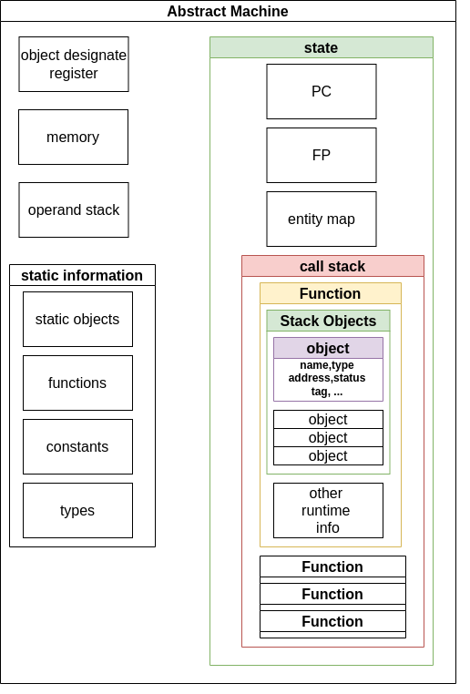
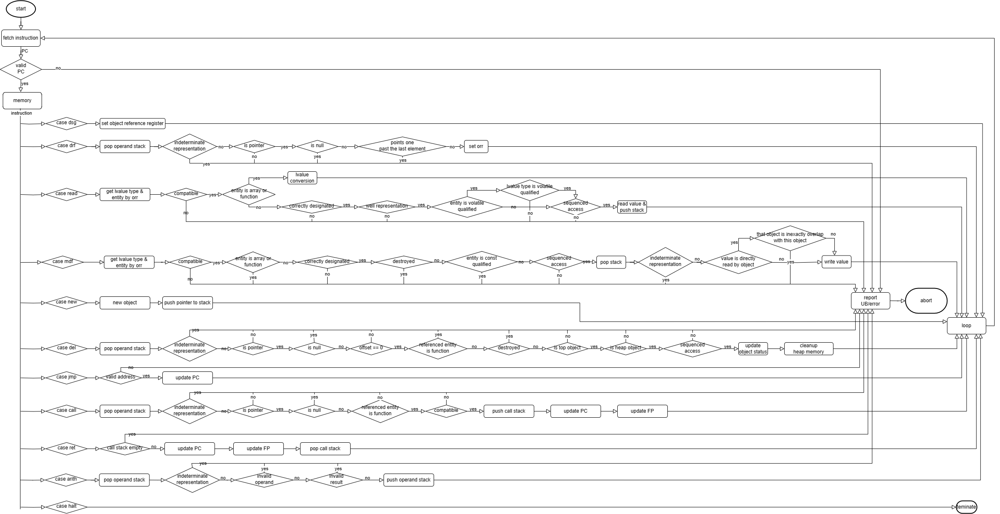
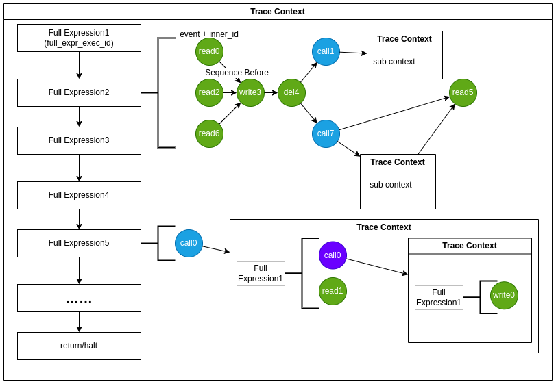
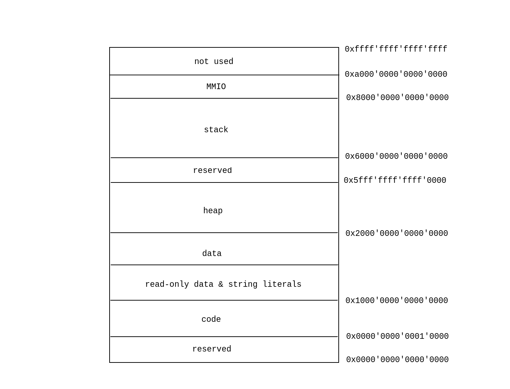

# CAMI 内部实现
内部实现文档设计内容较多，正在逐步完善中。

## 抽象机
### 综述
考虑到C语言是基于表达式求值的语言，而表达式求值适合用栈表达，我们将抽象机设计为栈式机，其结构如下：



其中：
+ 对象定位寄存器是访问对象的枢纽，所有对于对象的访问都需要定位对象再进行读写，而定位对象的结果将会被存放在对象定位寄存器中
+ 运算数栈用于进行表达式 evaluation，是运算功能的核心。同时，函数调用和指针解引用的功能也涉及到运算数栈
+ 内存部分用于存放 CAMI 进程实际读写的数据。内存采取了分段机制，详见[虚拟内存管理](#虚拟内存管理)
+ 静态信息部分记录了从 C 语言源代码获取到的信息，如源文件中所有函数的函数名、函数类型、一个全表达式内部各个追踪事件的 sequence after 关系等。
+ 动态信息（state）部分维护了抽象机的运行状态，主要用于维持正常的数据流转换和未定义行为检测。其中，实体映射表（entity map）记录了当前状态下实体地址到实体的映射关系，用于整数到指针的类型转换。

> CAMI 进程指某个字节码在 CAMI 上的运行实例，而不是宿主机上运行的名为cami的进程，亦可类比为虚拟机内运行的进程和虚拟机进程本身的关系。
> 
> 实体定义为对象或函数。
> 
> 追踪事件是调用函数、修改对象、非左值转换地读取对象和删除对象的通称。

抽象机的运行逻辑和CPU的运行逻辑相同，即取值、译码、执行、循环。具体而言：
+ 抽象机会根据 PC 值从内存中取出指令并译码
+ 若当前指令为停机指令，则停机
+ 否则，进行未定义检测并执行当前指令
+ + 若当前指令是数据流控制指令，则会更改程序指针和/或调用栈信息，跳转到第一步进行执行
+ + 若当前指令是对象定位指令，则会根据运算数栈顶元素或当前指令信息定位对象，并将对象元数据保存在对象定位寄存器中
+ + 若当前指令是对象读写指令，则会读取或写入被对象定位寄存器定位的对象的值，涉及运算数栈和数据区的读写
+ + 若当前指令是对象读写创建、删除指令，则会创建、更改或删除对象元数据信息
+ + 若当前指令是运算指令，则会弹出栈顶（和此栈顶）元素运算后将结果压回栈中
+ + 若当前指令是栈操作指令，则会进行压栈、弹栈、复制栈顶元素等操作
+ 更新 PC 值，跳转到第一步进行执行

一个示意性的执行逻辑流程图如下：


### 表达式 evaluation
CAMI 对表达式的 evaluation 的过程完全遵循 C23 标准的描述，为了降低复杂度，我们将该过程分层了三个层级，分别为抽象机层级、值盒（ValueBox）层级和值层级。

#### 值层级
值层级仅处理同类型实数间的运算，以及指针类型和 nullptr_t 类型的值的判等操作。后者较为简单，不再赘述。前者主要进行值的计算并进行未定义行为检测，例如结果溢出，移位运算符的左操作数是负数等。整数类型的值均用`uint64_t`类型的对象存储并自动完成扩展（零扩展和符号扩展）操作。浮点类型的值采用 C 语言的`float`和`double`类型存储，且运算直接采用了硬件运算（即直接使用 C 语言层级的运算符对浮点数据进行运算）而不是采用软件模拟。

#### 值盒层级
值盒是对所有类型的值的包装，其拥有被包装的值的所有权。值盒的存在方便了值的创建和删除以及实数类型间的运算。值盒不参与指针运算。值盒执行整数提升（integer promotion）和通常运算转换操作（usual arithmetic conversion），将转换后的结果按照类型转发给值层级进行下一步的操作。

#### 抽象机层级
抽象机层级的 evaluation 分离了指针运算和实数运算，后者交予值盒层级进行处理。指针运算分为三种，指针和整数的加（减）法，指针间的减法和指针间的比较。具体行为参见[操作语义](./operational_semantic.md)。

### 静态数据
静态数据包含对于静态或线程存储周期的对象和函数的描述，程序中使用到的所有常量和类型。

对静态或线程存储周期对象的描述包含该对象的名称、类型和地址。

对函数的描述包含函数的名称、类型、地址、当前函数的实现所在的源文件、栈帧大小、函数字节码大小、同时存活的自动存储周期对象的最多个数、块描述信息、全表达式信息和定位信息（函数字节码地址到C程序源代码行号的对应关系）。

> 函数字节码定义为CAMI字节码中描述函数运行逻辑的抽象机指令。函数字节码是 CAMI 字节码的一部分，即CAMI字节码函数节下函数对象的code字段。
>
> 关于块描述信息、全表达式信息和定位信息参见[CAMI 字节码规范](./cami_bytecode.md)

### 动态数据
动态数据包括程序计数器（PC）、栈指针（FP）、实体映射表（entity map）和调用栈信息。

调用栈信息包含了当前存在的函数实例（注意和函数静态信息区分），函数实例中记录其对应的静态信息、返回地址、已进入的块、当前存活的自动存储周期对象的对象元数据以及执行过程追踪信息。

记录已进入的块（因为`lb`指令不包含要推出的块的ID）用于创建和删除自动存储周期对象。

对象元数据记录了其关联的对象的状态信息，包含关联对象的名称、类型、地址、状态（良好、被销毁、未初始化或非值表示）、追踪事件标记（见下节）、以及对象元信息间的引用信息（子对象、引用对象、被引用对象）。

执行过程追踪信息用于追踪函数的执行历史，主要用于对 UB 34 的检测。执行过程追踪信息包含当前被 evaluation 的全表达式的ID,当前函数执行完了多少全表达式（即`full_expr_exec_id`的含义），以及当前函数实例所在的追踪上下文。

#### 追踪上下文

一个追踪上下文（在上图中以矩形表示）唯一关联一个函数实例（反之亦然），其记录了其关联的函数实例的父函数的追踪上下文，以及其关联的函数实例的在其父函数中的调用点（产生该函数实例的函数调用所在的位置，在上图中以蓝色或紫色圆圈表示）。

追踪事件标记（在上图中以圆圈表示）记录了某一追踪事件所在的追踪上下文，以及其在追踪上下文中的位置。位置信息可用全表达式执行ID（`full_expr_exec_id`）和内部ID表示。

追踪上下文的作用在于追溯函数的调用历史。通过追踪事件标记可以找到它所在的追踪上下文以及位置，通过该追踪上下文又可以找到其父追踪上下文，如此重复，可以得到该追踪事件的整个调用历史。

> 在每次发生函数调用时都会创建一个新的函数实例。
> 
> 函数实例的父函数定位为调用该函数实例的函数实例。
>
> 追踪事件标记的类型即为该标记对应的追踪事件的类型。

### 对象定位寄存器
对象定位寄存器保存当前被定位对象的对象元数据，定位该对象的左值的类型和偏移量。后两者的存在是必要的，例如
```c
int x = 0;
char* p = (char*)&x;
int y = *(p + 1);
```
上述代码中，`*(p + 1)`定位到了对象`x`，但左值类型为`char`，而不是`int`，且相对于`x`的首地址有一字节的偏移。

### 运算数栈
运算数栈暂存了当前运算结果，且元素为富值（rich value），即在值盒的基础上添加了属性。当前富值的属性有两条，其一是当前值是否是不确定表示（indeterminate representation)，其二是该值是否是从某一对象直接读取出来的结果，而不是通过运算得到的结果。

> 富值的命名方式参考了“富文本”。

### 内存管理


内存的分段情况如上图所示，其中代码和数据段的实际长度在启动加载时决定。堆段采用了分页的管理机制（参见现代操作系统的虚拟内存管理），用户可配置页大小（默认大小16K）和页表层级（默认采用四级页表）。MMIO 段目前设置了八个对象，名称分别为`control`和`word0`至`word6`。`control`对象用于指定进行的操作，`wordN`对象指定参数，用法示例可参见[hello_world.tbc](../../etc/example_hello_world.tbc)中的`puts`函数。`control`对象可写入的值及其参数如下：
|操作|control|word0|word1|word2|word3|word4|word5|word6|
|----|-------|----|-----|------|----|------|----|------|
|打开文件|0|文件名字符串地址|文件名长度|打开模式|若成功打开，指定应返回的文件描述符。可指定为-1使CAMI自行分配|-|-|-|
|关闭文件|1|要关闭的文件的文件描述符|-|-|-|-|-|-|
|读文件|2|要读的文件的文件描述符|结果缓冲区的地址|读取的长度|-|-|-|-|
|写文件|3|要写的文件的文件描述符|写入数据的地址|写入的长度|-|-|-|-|
|移动文件指针|4|要移动的文件的文件描述符|移动到的目标（文件头尾或当前位置）|偏移量|-|-|-|-|
|更改文件大小|5|要更改的文件的文件描述符|更改后的大小|-|-|-|-|-|
|重命名文件|6|原文件的名字字符串地址|原文件的名字长度|更改后的文件名字字符串地址|更改后的文件名字长度|-|-|-|
|删除文件|7|要删除的文件的名字字符串地址|要删除的文件的名字长度|-|-|-|-|-|
|复制文件描述符|8|源文件描述符|目标文件描述符|-|-|-|-|-|

`control`对象在操作完成后会设置错误码（读写文件操作还可能返回实际读写的长度），以指示操作是否成功。若错误原因源自对系统调用等的失败，`word0`对象会额外指出该系统调用的错误码。

目前上述操作和参数都是对 posix 相应文件操作 API 的封装。 

### 对象元数据管理
我们采用了垃圾回收技术进行了对象元数据的生命周期管理。垃圾回收的算法上，我们采用了分代回收的算法，将对象元数据分为年轻代和老年代，年轻代又分为伊甸区（eden）和幸存者区（survivor）。当伊甸区满时会触发 minor GC，而当老年代区域满时会触发 major GC,当进行完垃圾回收后空间仍不足则会产生内存溢出，CAMI会立即停机。

## 翻译器
除文本形式和二进制形式的字节码外，我们还定义了内存形式的字节码文件，且分为链接前的（未链接的）内存形式字节码和链接后的。前者的更便于进行链接操作，而后者则更符合抽象机的需求。
### 汇编
CAMI 汇编器会先进行递归下降的语法解析，执行简单的静态检查并生成未链接的内存形式字节码，若当前字节码文件类型为可执行文件或动态链接文件，汇编器会自动调用链接器链接该文件。
### 反汇编
反汇编器接收内存形式的字节码并输出文本形式的字节码，经过反汇编得到的字节码文件可被再次汇编且不丢失信息。
### 链接
CAMI 支持将一个或多个对象文件链接为一个对象文件或可执行文件或动态链接文件。
#### 链接为对象文件
将多个对象文件链接为一个对象文件的过程涉及如下操作：
+ 链接各个对象文件的属性
+ + 确定链接后文件的模块名或入口函数
+ + 将所有对象文件需要静态链接的文件名合并并去重后，再去除当前参与链接的所有文件名
+ + 将所有对象文件需要动态链接的文件名合并并去重
+ 丢弃所有对象文件的注释节
+ 将所有对象文件的对象、函数节简单合并在一起
+ 对字符串字面量去重，并进行重定向
+ 将所有对象文件中出现的类型和常量合并在一起并去重

#### 链接为动态链接文件
将多个对象文件链接为一个对象文件的过程涉及如下操作：
+ 将多个对象文件链接为一个对象文件
+ 重排列得到的对象文件的函数和对象节，在不改变相对位置的情况下，使相同段的函数或对象排列在一起
+ 重定向函数字节码中的符号信息，将符号转换为数字
+ 修正函数和对象的地址

#### 链接为可执行文件
链接器会先将输入链接为对象文件，插入启动函数，并执行和“链接为动态链接文件”同样的操作（重排列、重定向和修正地址）。其中，启动函数的第一条指令是 CAMI 启动后运行的第一条指令。启动函数依次调用所有初始化函数、线程初始化函数和入口函数后执行停机指令。

